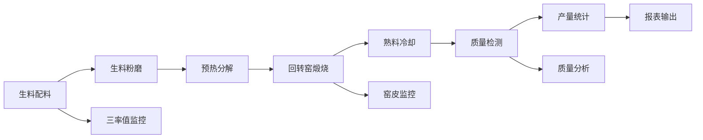

## 1. 产品概述

水泥厂回转窑熟料业务Web系统，为熟料车间提供全流程数字化管理平台，覆盖从生料配料到熟料冷却的完整生产链条。系统帮助工艺工程师、车间管理员和操作员实时监控生产参数、优化配料方案、控制煅烧质量，实现精细化生产管理。

- 解决问题：传统人工记录数据滞后、参数调整不及时、质量追溯困难等痛点
- 目标用户：熟料车间操作员、工艺工程师、生产管理员、质量检测人员
- 产品价值：提升熟料产量和质量稳定性，降低能耗和生产成本，实现数据驱动的生产决策

## 2. 核心功能

### 2.1 用户角色

| 角色 | 注册方式 | 核心权限 |
|------|----------|----------|
| 车间管理员 | 系统注册 | 所有模块查看与配置、数据导出、用户管理 |
| 工艺工程师 | 系统注册 | 参数配置、质量分析、配料方案调整 |
| 操作员 | 系统注册 | 数据录入、实时监控、异常报警确认 |
| 质检人员 | 系统注册 | 质量数据录入、质量报告查看 |

### 2.2 功能模块

1. **总览仪表盘**：核心指标概览、实时生产状态、异常报警展示
2. **生料配料模块**：石灰石及原料配比管理、生料三率值计算与控制
3. **生料粉磨模块**：生料磨细度监控、粉磨参数记录
4. **预热分解模块**：预热器各级温度监控、分解炉用煤量管理
5. **回转窑煅烧模块**：窑头喂煤量、窑速窑电流、窑皮厚度监控
6. **熟料冷却模块**：篦冷机运行参数、熟料冷却效果监控
7. **台时产量模块**：实时产量统计、班次产量汇总、历史产量趋势
8. **质量控制模块**：熟料游离钙、立升重检测、质量趋势分析

### 2.3 页面详情

| 页面名称 | 模块名称 | 功能描述 |
|----------|----------|----------|
| 总览仪表盘 | KPI概览卡片 | 显示当前台时产量、熟料游离钙、立升重、窑速等核心指标 |
| 总览仪表盘 | 实时状态面板 | 展示窑系统运行状态、各环节温度/压力参数 |
| 总览仪表盘 | 异常报警列表 | 显示超限参数、报警级别、处理状态 |
| 生料配料 | 原料配比面板 | 石灰石、粘土、铁粉、砂岩等原料配比设置与显示 |
| 生料配料 | 三率值计算 | 石灰饱和系数(KH)、硅率(SM)、铝率(IM)实时计算与目标值对比 |
| 生料粉磨 | 细度监控 | 生料0.08mm筛余、比表面积实时数据与趋势图 |
| 预热分解 | 预热器温度 | C1-C5各级旋风筒温度、压力参数显示 |
| 预热分解 | 分解炉用煤 | 分解炉喂煤量、温度、风煤比监控 |
| 回转窑煅烧 | 窑头喂煤 | 窑头喂煤量、火焰温度、一次风压显示 |
| 回转窑煅烧 | 窑速窑电流 | 窑转速、主电机电流、窑功率趋势图 |
| 回转窑煅烧 | 窑皮监控 | 窑筒体温度分布、窑皮厚度估算与异常预警 |
| 熟料冷却 | 篦冷机参数 | 篦速、各风室风量风压、料层厚度显示 |
| 熟料冷却 | 冷却效果 | 熟料出料温度、冷却效率计算与显示 |
| 台时产量 | 实时产量 | 当前小时产量、累计产量、瞬时喂料量 |
| 台时产量 | 产量统计 | 按班次/日/周/月的产量汇总、同比环比分析 |
| 质量控制 | 游离钙检测 | 熟料f-CaO检测数据录入、合格率统计、趋势分析 |
| 质量控制 | 立升重检测 | 熟料立升重数据录入、分布统计、趋势分析 |
| 质量控制 | 质量报表 | 生成班报、日报、月报，支持导出 |

## 3. 核心流程

操作员登录系统后，在总览仪表盘查看当前生产状态。根据工艺要求，在生料配料模块调整原料配比并监控三率值；生料粉磨后进入预热分解环节，监控预热器温度和分解炉用煤；回转窑煅烧过程中实时调整窑速、喂煤量，监控窑皮状态；熟料经篦冷机冷却后，检测游离钙和立升重质量指标，系统自动统计台时产量并生成质量报表。

## 4. 用户界面设计

### 4.1 设计风格

- 主色调：工业蓝(#1E40AF)作为主色，橙红色(#F97316)作为警示强调色，配合深灰(#1F2937)和浅灰(#F3F4F6)背景
- 辅助色：绿色(#10B981)表示正常、黄色(#F59E0B)表示预警、红色(#EF4444)表示报警
- 按钮风格：扁平化直角按钮，悬停时出现微阴影效果
- 字体：使用思源黑体(Source Han Sans)作为主字体，等宽字体用于数据显示
- 布局风格：顶部导航栏 + 侧边模块菜单 + 主内容区的经典工业监控布局
- 图标风格：使用线性工业风格图标，清晰表达设备和参数含义
- 数据可视化：使用仪表盘、趋势曲线、柱状图、热力图等多种图表形式

### 4.2 页面设计概览

| 页面名称 | 模块名称 | UI元素 |
|----------|----------|--------|
| 总览仪表盘 | KPI概览卡片 | 卡片式布局，大号数字显示，状态指示灯，渐变背景 |
| 总览仪表盘 | 实时状态面板 | 设备示意图，参数标注，实时刷新动画 |
| 总览仪表盘 | 异常报警列表 | 带颜色标识的列表项，报警闪烁效果，处理按钮 |
| 生料配料 | 原料配比面板 | 滑块+数字输入框，饼图显示配比，目标值对比条 |
| 生料配料 | 三率值计算 | 仪表盘显示当前值，目标值范围带，趋势小图 |
| 生料粉磨 | 细度监控 | 折线趋势图，控制上下限标线，合格率统计 |
| 预热分解 | 预热器温度 | 设备示意图+温度标注，各级温度柱状对比图 |
| 预热分解 | 分解炉用煤 | 实时曲线，风煤比显示，用量累计 |
| 回转窑煅烧 | 窑头喂煤 | 喂煤量趋势，火焰状态指示，参数联动显示 |
| 回转窑煅烧 | 窑速窑电流 | 双轴趋势图，电流波动分析，功率计算 |
| 回转窑煅烧 | 窑皮监控 | 筒体温度热力图，窑皮厚度曲线，异常位置高亮 |
| 熟料冷却 | 篦冷机参数 | 分区参数显示，风量风压矩阵，料层厚度指示 |
| 熟料冷却 | 冷却效果 | 温度曲线，冷却效率进度条，出料温度显示 |
| 台时产量 | 实时产量 | 大号数字，瞬时流量曲线，累计进度条 |
| 台时产量 | 产量统计 | 柱状图+折线图组合，时间筛选器，同比环比指标 |
| 质量控制 | 游离钙检测 | 数据表格，控制图，合格率饼图 |
| 质量控制 | 立升重检测 | 数据录入表单，分布直方图，趋势线 |
| 质量控制 | 质量报表 | 报表预览，导出按钮，时间范围选择 |

### 4.3 响应式设计

- 采用桌面端优先设计，适配1920x1080及以上分辨率
- 侧边栏在平板端可折叠收起，移动端采用底部Tab导航
- 图表组件自适应容器宽度，关键数据在小屏幕上优先展示
- 数据表格在移动端支持横向滚动，固定首列

