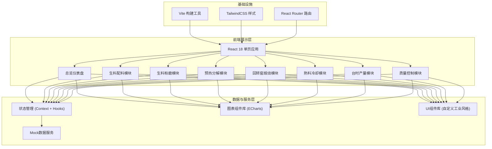

## 1. 架构设计



## 2. 技术描述

- 前端框架：React 18 + TypeScript
- 构建工具：Vite 5.x
- 样式方案：TailwindCSS 3.x + 自定义CSS变量
- 路由管理：React Router 6.x
- 图表可视化：ECharts 5.x（工业场景首选，支持热力图、仪表盘、实时曲线等）
- 状态管理：React Context + useReducer（轻量级方案，适合该规模应用）
- 图标方案：Lucide React + 自定义工业图标SVG
- 数据方案：前端Mock数据，模拟实时数据刷新
- 后端：无（纯前端演示系统，所有数据通过Mock模拟）

## 3. 路由定义

| 路由路径 | 页面名称 | 模块说明 |
|----------|----------|----------|
| /dashboard | 总览仪表盘 | 核心KPI、实时状态、异常报警 |
| /raw-material | 生料配料模块 | 原料配比、三率值计算与控制 |
| /grinding | 生料粉磨模块 | 生料细度监控、粉磨参数 |
| /preheater | 预热分解模块 | 预热器温度、分解炉用煤 |
| /kiln | 回转窑煅烧模块 | 窑头喂煤、窑速电流、窑皮监控 |
| /cooler | 熟料冷却模块 | 篦冷机参数、冷却效果 |
| /production | 台时产量模块 | 实时产量、统计分析 |
| /quality | 质量控制模块 | 游离钙、立升重、质量报表 |

## 4. 数据模型

### 4.1 数据模型定义

```mermaid
erDiagram
    PRODUCTION_STATUS {
        string id PK
        string timestamp
        number kilnSpeed
        number kilnCurrent
        number feedRate
        number outputRate
        string status
    }
    
    RAW_MATERIAL {
        string id PK
        string timestamp
        number limestone
        number clay
        number ironPowder
        number sandstone
        number coalAsh
        number kh_value
        number sm_value
        number im_value
    }
    
    GRINDING_DATA {
        string id PK
        string timestamp
        number sieveResidue_008
        number sieveResidue_002
        number specificSurface
        number millCurrent
        number feedRate
    }
    
    PREHEATER_DATA {
        string id PK
        string timestamp
        number c1_temp
        number c1_pressure
        number c2_temp
        number c2_pressure
        number c3_temp
        number c3_pressure
        number c4_temp
        number c4_pressure
        number c5_temp
        number c5_pressure
        number calcinerTemp
        number calcinerCoalRate
        number airCoalRatio
    }
    
    KILN_DATA {
        string id PK
        string timestamp
        number kilnSpeed
        number kilnCurrent
        number kilnPower
        number kilnHeadCoalRate
        number flameTemp
        number primaryAirPressure
        number kilnInletTemp
        number kilnOutletTemp
    }
    
    KILN_SHELL {
        string id PK
        string timestamp
        number position
        number temperature
        number brickThickness
    }
    
    COOLER_DATA {
        string id PK
        string timestamp
        number grateSpeed
        number chamber1AirFlow
        number chamber1Pressure
        number chamber2AirFlow
        number chamber2Pressure
        number chamber3AirFlow
        number chamber3Pressure
        number bedThickness
        number clinkerOutletTemp
        number coolingEfficiency
    }
    
    QUALITY_DATA {
        string id PK
        string timestamp
        string sampleNo
        number fCao
        number literWeight
        number strength_3d
        number strength_28d
        string inspector
    }
    
    PRODUCTION_STAT {
        string id PK
        string date
        string shift
        number hourlyOutput
        number dailyOutput
        number monthlyOutput
        number standardCoalConsumption
        number powerConsumption
    }
    
    ALARM {
        string id PK
        string timestamp
        string parameter
        number value
        number threshold
        string level
        string status
        string handler
    }
```



### 4.2 核心数据实体说明

| 数据实体 | 用途说明 | 关键字段 |
|----------|----------|----------|
| PRODUCTION_STATUS | 实时生产状态 | 窑速、窑电流、喂料量、产量 |
| RAW_MATERIAL | 生料配料记录 | 各原料配比、三率值(KH/SM/IM) |
| GRINDING_DATA | 生料粉磨数据 | 筛余值、比表面积、磨机电流 |
| PREHEATER_DATA | 预热分解数据 | C1-C5温度压力、分解炉参数 |
| KILN_DATA | 回转窑运行数据 | 窑速、电流、喂煤、温度 |
| KILN_SHELL | 窑筒体温度分布 | 位置、温度、耐火砖厚度 |
| COOLER_DATA | 篦冷机数据 | 篦速、风量风压、冷却效率 |
| QUALITY_DATA | 质量检测数据 | f-CaO、立升重、强度 |
| PRODUCTION_STAT | 产量统计 | 台时/日/月产量、能耗 |
| ALARM | 异常报警记录 | 参数、阈值、级别、处理状态 |

## 5. 项目目录结构

```
src/
├── components/           # 公共组件
│   ├── layout/           # 布局组件（侧边栏、顶栏）
│   ├── charts/           # 图表封装组件
│   ├── cards/            # 卡片组件
│   ├── forms/            # 表单组件
│   └── indicators/       # 状态指示器
├── pages/                # 页面组件
│   ├── Dashboard/        # 总览仪表盘
│   ├── RawMaterial/      # 生料配料
│   ├── Grinding/         # 生料粉磨
│   ├── Preheater/        # 预热分解
│   ├── Kiln/             # 回转窑煅烧
│   ├── Cooler/           # 熟料冷却
│   ├── Production/       # 台时产量
│   └── Quality/          # 质量控制
├── data/                 # Mock数据
│   ├── constants/        # 常量配置
│   └── mock/             # Mock数据生成
├── hooks/                # 自定义Hooks
├── types/                # TypeScript类型定义
├── utils/                # 工具函数
├── App.tsx
├── main.tsx
└── index.css
```

